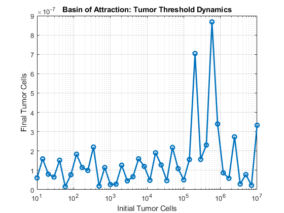
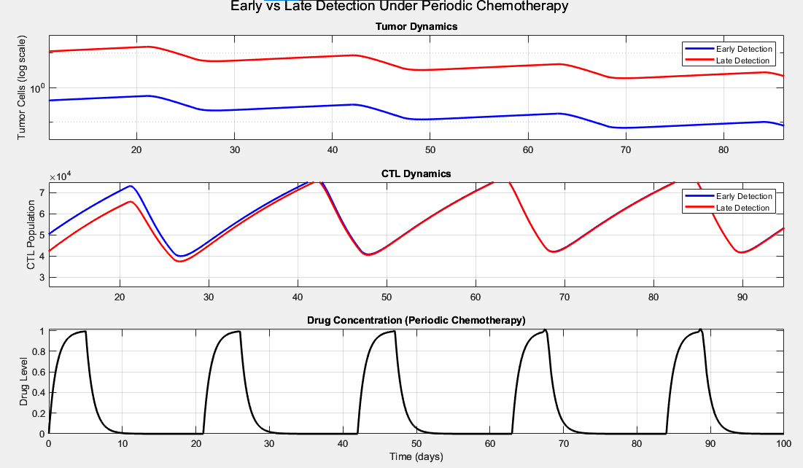
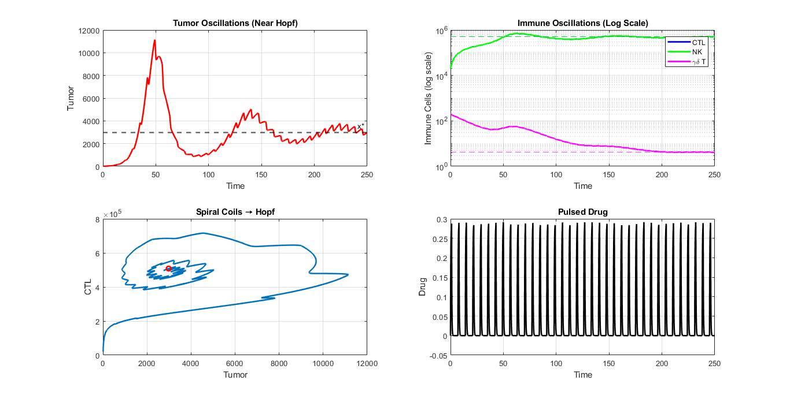
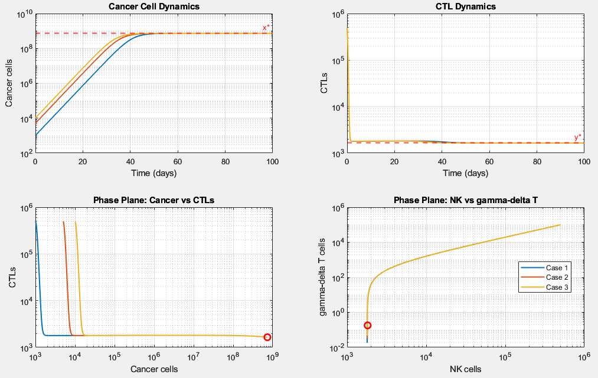
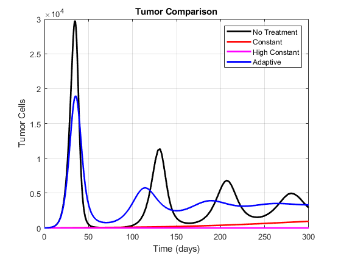

# Breast Cancer–Immune Dynamics with Chemotherapy

## Overview

This repository contains my undergraduate research project:

**Mathematical Modeling and Analysis of Breast Cancer–Immune Dynamics with Chemotherapy Treatment**

The project was completed as part of the Bachelor of Science Honours Degree in Mathematics and Computational Sciences at the University of Zimbabwe.

The study uses mathematical modelling and numerical simulations to investigate the interaction between breast cancer cells, immune responses and chemotherapy treatment.

## Research Focus

The mathematical model describes interactions between tumour cells, immune cells and chemotherapy drug concentration.

The study investigates:

- Tumour growth and immune-cell responses
- Early versus late detection
- Different chemotherapy treatment strategies
- Tumour persistence and tumour-free dynamics
- Stability and coexistence of tumour and immune populations
- Bifurcation and limit-cycle behaviour
- Tumour threshold dynamics

## Research Objectives

The main objectives of the study were to:

1. Develop a mathematical model of breast cancer and immune dynamics.
2. Analyse the behaviour and stability of the model.
3. Investigate the effects of chemotherapy treatment.
4. Examine the effects of early and late detection.
5. Explore different treatment strategies through numerical simulations.
6. Investigate conditions associated with tumour persistence and tumour-free outcomes.

## Model Components

The model considers interactions between:

- Tumour cells
- Cytotoxic T lymphocytes (CTLs)
- Natural killer (NK) cells
- Gamma-delta T cells
- Chemotherapy drug concentration

## Computational Methods

The computational analysis was implemented in MATLAB.

Methods used include:

- Numerical solution of systems of ordinary differential equations
- `ode45` numerical integration
- Parameter variation
- Equilibrium analysis
- Jacobian and eigenvalue analysis
- Stability analysis
- Bifurcation analysis
- Phase-plane analysis
- Chemotherapy treatment simulations
- Tumour threshold and basin-of-attraction analysis

## MATLAB Simulations

The `matlab/` folder contains the MATLAB scripts used for the computational analysis.

The simulations include:

- Early versus late detection
- Constant versus adaptive chemotherapy
- Continuous versus pulsed chemotherapy
- Stability and coexistence
- Hopf bifurcation and limit cycles
- Stability and bifurcation analysis
- Tumour persistence versus tumour-free dynamics
- Coexistence and phase-plane analysis
- Tumour threshold dynamics
- Different chemotherapy treatment schemes

See the [`matlab/README.md`](matlab/README.md) file for descriptions of the individual scripts.

## Selected Results

The `results/` folder contains figures generated from the computational simulations.

### Constant vs Adaptive Chemotherapy


This simulation compares tumour dynamics under constant and adaptive chemotherapy strategies.

### Tumour Threshold Dynamics



The basin-of-attraction analysis illustrates the relationship between the initial tumour burden and the final tumour population, highlighting a threshold separating tumour elimination from tumour persistence.

### Early vs Late Detection



This simulation compares tumour dynamics under early and late detection scenarios and examines the effect of the timing of intervention on tumour progression.

### Hopf Bifurcation and Limit Cycle



This simulation explores Hopf bifurcation behaviour and the emergence of limit-cycle dynamics in the mathematical model.

### Stability and Coexistence



This simulation investigates the stability and coexistence behaviour of tumour and immune-cell populations.

### Treatment Strategy Comparison



This simulation compares tumour dynamics under no treatment, constant chemotherapy, high-dose constant chemotherapy and adaptive chemotherapy.

## Repository Contents

```text
breast-cancer-immune-dynamics/
│
├── README.md
│
├── Breast_cancer_research (1).pdf
│
├── matlab/
│   ├── README.md
│   └── MATLAB simulation scripts
│
└── results/
    ├── Constant vs Adaptive Chemotherapy.png
    ├── basin_of_attraction.png
    ├── early_vs_late_detection.png
    ├── hopf_bifurcation_limit_cycle.png
    ├── stability_coexistence.png
    └── treatment_strategy_comparison.png
